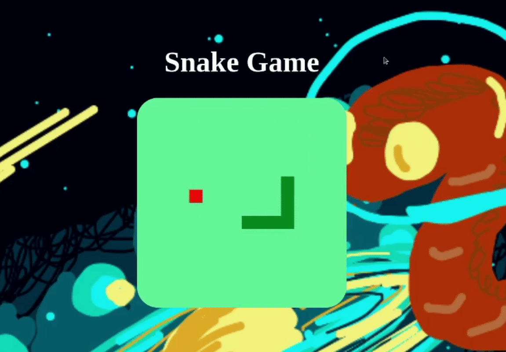

  <h1>Snake Game🐍</h1>
  <h2>Projeto jogo da cobrinha. Projeto com objetivo de demonstrar aptidões e possibilidades na linguagem javascript. Por meio de criar um jogo divertido e nostálgico</h2>
  
  

  

 

  

## 🕹 Modo de jogar 🕹
#### Para movimentar a Snake é bem simples, basta utilizar as setas do teclado ➡️ ⬅️ ⬆️ ⬇️
 
  <h4>🕹 Link Do Game 🐍
  
  <a href="https://jogo-da-cobrinha-sable.vercel.app/">🕹🕹🕹PLAY🕹🕹🕹</a>
  
  </h4>

### 🚧 Andamento para mobile 🚧

